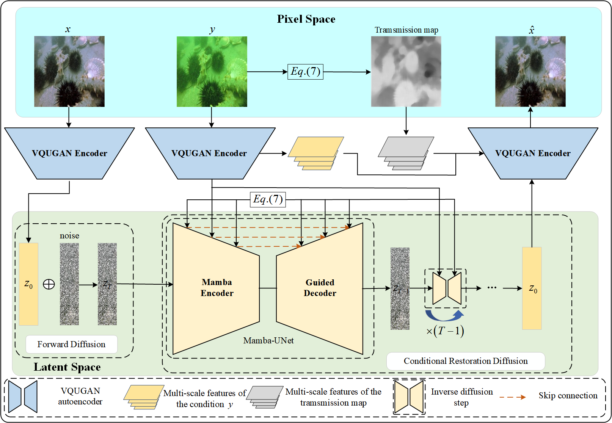

# WaterDiff: Underwater Image Enhancement Latent Diffusion Model based on Mamba and Transmission Map Guidance

Meisheng Guan, Haiyong Xu, Gangyi Jiang, Mei Yu, Xuebo Zhang, Yeyao Chen and Ting Luo

## Abstract

Underwater imaging is affected by absorption and SCAtering, leading to issues such as low contrast, poor clarity, color deviation, and haze. To address these problems, we propose a Mamba-based latent diffusion model (LDM) for underwater image enhancement, named WaterDiff, which leverages the potential of LDM and the guidance provided by the transmission map. To alleviate the substantial computational cost incurred by pixel-based diffusion recovery, a latent-based method is utilized, whereby the degraded underwater image is first transformed by a feature encoder and then restored in the compact latent space. However, two main issues are identified that limit the performance of LDM-based methods. First, the compression of the latent space tends to produce reconstruction distortions. Second, existing diffusion models primarily leverage the convolutional neural network (CNN) or Transformer architectures as the denoising network. Unfortunately, CNN lacks the ability to capture global receptive fields, resulting in suboptimal prediction performance, whereas Transformers exhibit excellent global modeling capabilities at the expense of quadratic time complexity with respect to image size, leading to substantial computational overhead. To address these challenges, two key components are proposed: (i) a feature encoder that extracts the multiscale features enhanced in the decoder to reduce distortions; (ii) Mamba encoder with linear complexity and transmission map guidance module integrated into the noise predictor to extract structural information, which enables more powerful latent-based image enhancement without significantly increasing inference costs. The experimental results demonstrate the superiority of the proposed WaterDiff and effectiveness of its modules. The code is publicly available at: https://github.com/Guan-MS/WaterDiff

## Overview




## Dependencies and Installation

This codebase was tested with the following environment configurations. It may work with other versions.

- Ubuntu 20.04
- CUDA 11.7
- Python 3.9
- PyTorch 2.0.1 + cu117

### Previous installation

To use the selective scan with efficient hard-ware design, the `mamba_ssm` library is needed to install with the folllowing command.

```
pip install causal_conv1d==1.0.0
pip install mamba_ssm==1.0.1
```

See [environment.yaml](./environment.yaml) for requirements on packages. Simple installation:

```
conda env create -f environment.yaml
```

## Pre-trained Model

If this paper is accepted, we will publish the code for the main framework.

The pre-trained model can be downloaded from [here](https://drive.google.com/drive/folders/1p0J1IJc99bs9iaIktrum0mmv3omfjSuw), and its corresponding config file is [this yaml](./configs/mamba_ldm/mamba-f16-c256-unet.yaml).

## Preparing datasets

### Datasets:

(1) UIEB (UIE): [Data](https://li-chongyi.github.io/proj_benchmark.html)

(2) SQUID (UIE): [Data](https://csms.haifa.ac.il/profiles/tTreibitz/datasets/ambient_forwardlooking/index.html)

(3) UICoD (UIE): [Data](https://github.com/TrentQiQ/UVE-38K)

(4) U45(UIE): [Data](https://github.com/IPNUISTlegal/underwater-test-dataset-U45-/tree/master/upload/U45)


To make use of the [evaluate.py](evaluate.py) and the files in [ldm/data/](./ldm/data/), the dataset folder names should be lower-case and structured as follows.

```
WaterDiff
├─ other files and folders
├─ dataset
│  ├─ demo_data
│  │  ├─ train_data
│  │  │  ├─ input
│  │  │  │  ├─ fig1.png
│  │  │  │  ├─ ...
│  │  │  ├─ target
│  │  │  │  ├─ fig1.png
│  │  │  │  ├─ ...
│  │  ├─ test_data
│  │  │  │  ├─ ...
```

## Training

WaterDiff is trained in two stages, where the VQUGAN and the mamba-UNet are trained separately.

### VQUGAN

```
python main.py --base configs/autoencoder/vq_f16×16×3.yaml -t --gpus 0,
```

### Denoising mamba-UNet

```
python main.py --base configs/ldm/mamba-f16-c256-unet -t --gpus 0,
```

These will create a `logs/` folder within which the corresonding directories are created for each experiment. The log files from training include checkpoints, images and tensorboard loggings.

To resume from a checkpoint file, simply use the `--resume` argument in [main.py](main.py) to specify the checkpoint.

## Acknowledgement

Our code is adapted from the original [latent-diffusion](https://github.com/danier97/LDMVFI) and [LDMVFI](https://github.com/danier97/LDMVFI?tab=readme-ov-file) repository. We thank the authors for sharing their code.
